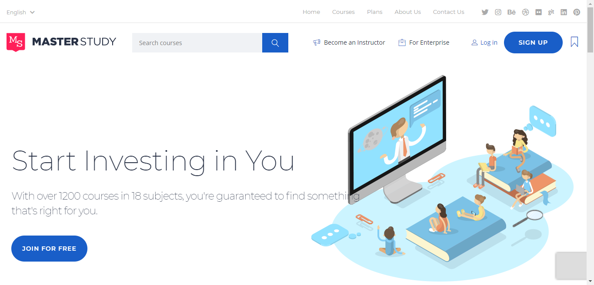

# OnlineCourses
Online Courses Website  is scalable web application written in python (Django). Online Courses was designed to provide pleasant experience for users.

# Installation
Assuming you use virtualenv, follow these steps to download and run the e-learning application in this directory:

$ git clone https://github.com/FathallaSelim/OnlineCourses.git

$ cd OnlineCourses

$ virtualenv venv

$ source ./venv/bin/activate

$ pip install -r requirements

$ python manage.py migrate

$ python manage.py runserver

Initial data supports 3 types of users for testing purposes:
User (username=selim1, password=admin)

Visit http://127.0.0.1:8000/
## Compatibility
Python 3.6

Django 2.0

SQLite
